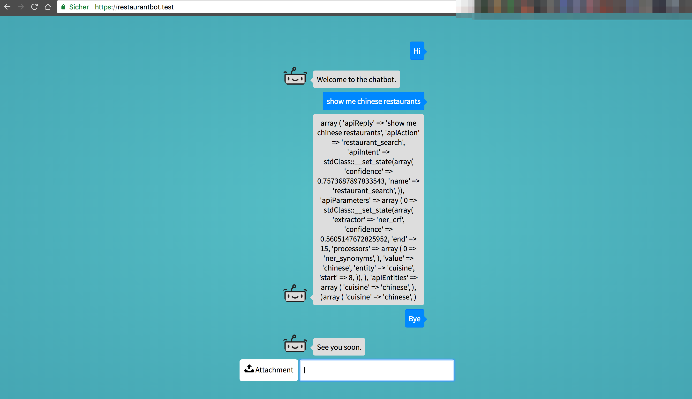

# Rasa NLU and BotMann (Technical Puncture)

This Repository combine Rasa NLU with BotMan 
to build a Chat Bot with Natural Language Understanding. 


## How to insall 

###  Install Rasa NLU
```
pip install rasa_nlu
```

### 1. Install rasa_nlu
```
pip install rasa_nlu[spacy]
python -m spacy download en_core_web_md
python -m spacy link en_core_web_md en
```

### 2. Optional Train your Rasa NLU
```
cd data
python -m rasa_nlu.train \
    --config ../config_spacy.yml \
    --data demo-rasa.json \
    --path restaurant_search
```

### 3. Start  Rasa NLU
```
cd data
python -m rasa_nlu.server --path restaurant_search
```

### 4. Install Web Interface
```
cd restaurantbot
composer install

valet link
valet securce
```

### 4. Open Web interface

https://restaurantbot.test/

#### Start Chatting


#### Curently Impelement
- :white_check_mark: greet
- :white_check_mark: goodbye
- :exclamation: restaurant_search
  * Missing to initerpret getExtras from Rasa NLU in differnt actions
- :exclamation: affirm


